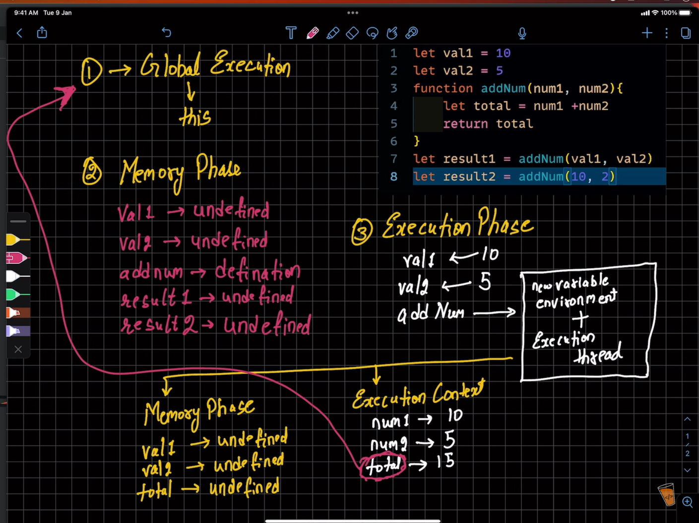
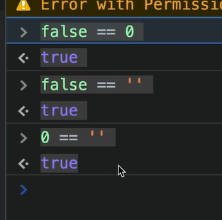

# JS_tut
following chai aur code ka js tut by hitesh sir

# Notes taking from office!
Functions:
 f(a,b){ #a and b are parameters
    SOMETHING SOMETHING
 }

 f(3,5) #here 3 and 5 are called arguments

 If a function is defined and has only one parameter and returning that but when I call it i pass 3 args, then it wont show error, will simply return the `st argument entered.

 any scope outside a block is GLOBAL scope and its acccessible everywhere but the block scope are not accessible outside that block (exceptio: var and c=40 types)

inw idnows, when we go inspect and console then global scope is different there and similalry its diff for when we execute the code with node 

//DOM: how to manipulate html page using js  

//iife: iMMEDIATELY INVOKED FUCNTION EXPRESSION
that whenver we open a file, a function runs itself, for example we open a file and database connection sets itself. 

An IIFE (Immediately Invoked Function Expression) is a function that executes immediately after it is defined. It helps in preventing global scope pollution by encapsulating variables within a function.

***************************************
javascript execution context:
   the way js runs, it does in two phases
   global ec, hamesha banta h jab bhi ham ko file exec karte h, jisko refer kardete h ham this se

jis bhi envt. me ham run karte h sabme this ki value alag hoti h, like browser ki alag, node ki alag, so jab ham broswer pe run karte h, then uski hoti h windows.

js ek single thread pe kaam karti h, aur iske liye har ek cheez process h

execution context:
   global, functional, and less known but present in mongo ki documentation: eval

first phase is memory cration phase:
   in this memory for variabels or functions is allocated andaall
   all teh varibales are declare but not insitialised nad assigned undefined
   and in function its definition is there.   

second is execution phase: all teh operations are done in this phase.
   in this valeus are assigned to the variables
   and if a varibale is assiened a function call then each time a function is created a new context environment is created in which there is new environmet variable and execution thread.
   after the work, this environment is deleted

whenever u want to see abt call stack how it works, go on inspect adn then source

false and truht values

------------------------
DOM: document object model
window is a complex object, READ, do window.documnt or document coz its known, console.dir(document) tog et everything as in winodw

everyhitng is a node in this tree like structure

whenw e do documnet.links, we get html collection not array
